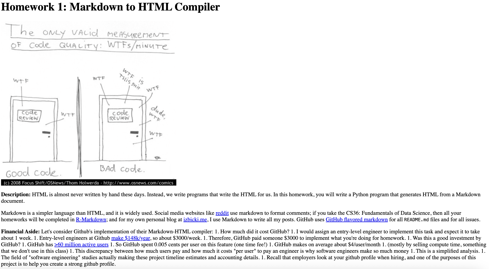
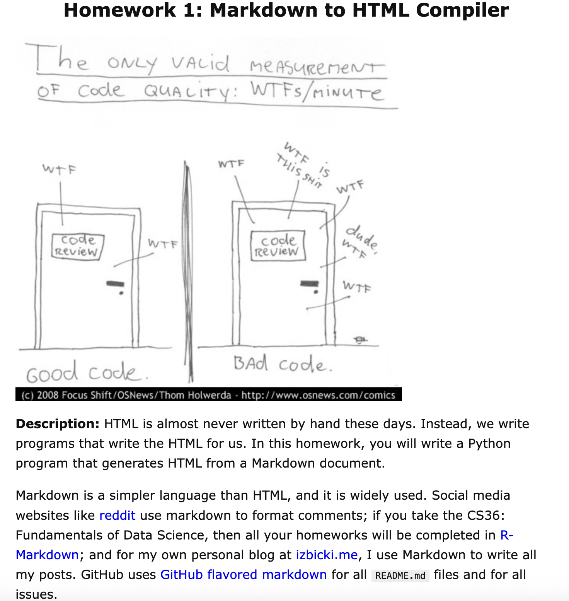

# Markdown to HTML compiler

&nbsp;
&nbsp;
&nbsp;

A simple project for converting markdown files to HTML.

Basic usage:
```
$ markdown-compiler example/README.md 
```

 

Fancy CSS formatting can be included with the flag `--add_css`: 
```
$ markdown-compiler example/README.md --add_css 
```

 